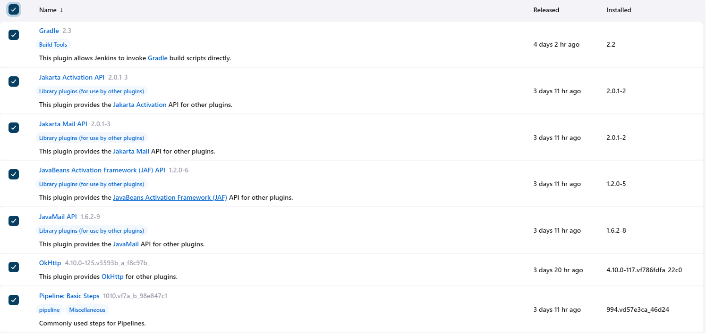

# ☕ Configuring Jenkins for Spring Boot java maven applications

### First make sure you have the following plugins installed on your Jenkins server:

<figure><figcaption></figcaption></figure>

<figure><figcaption></figcaption></figure>
